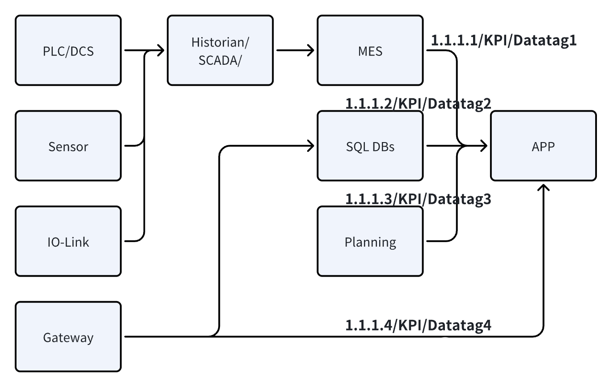
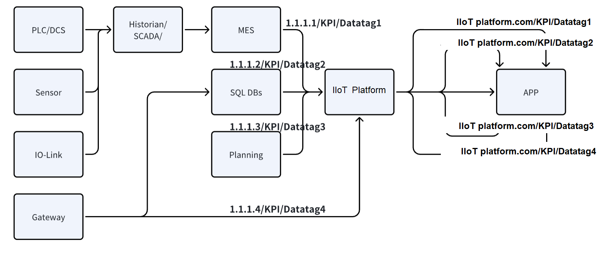
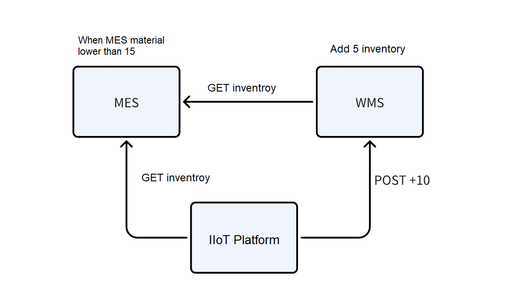
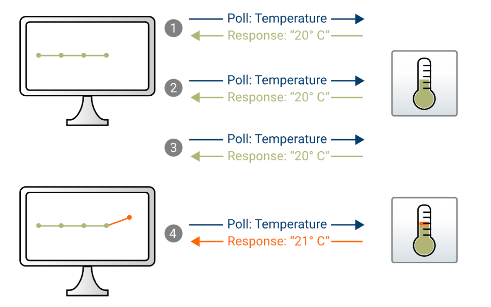
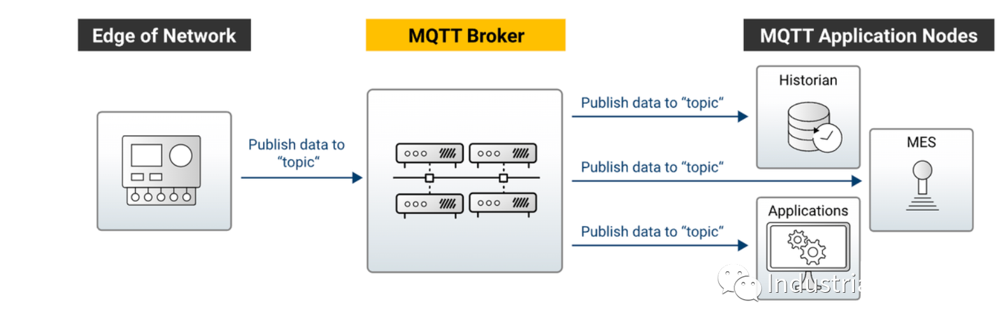
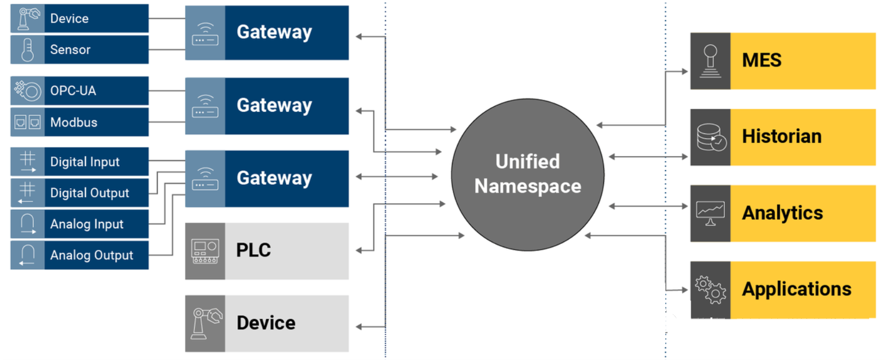
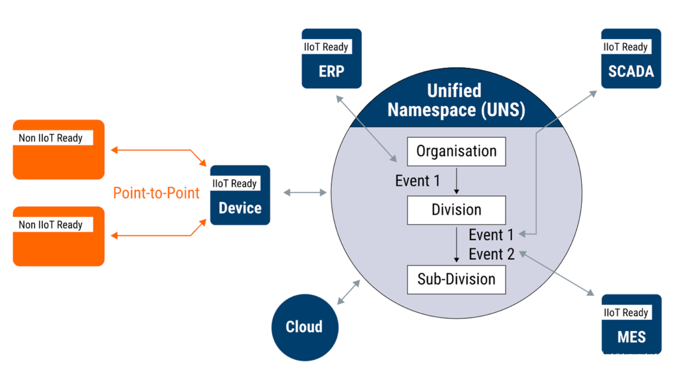

This article attempts to introduce, in a direct and accessible manner, a concept that both nourishes and challenges digital suppliers, along with its best practices.

<!--truncate-->

## Current Situation

The industrial data foundation generally refers to the formatting and aggregation of various data sources into a single location for easy consumption by other applications.

In today's market defined by **Industrial Internet of Things (IIoT)**, the industrial data foundation is implemented as follows:

1. Connecting existing customer software via RESTful API to parse TCP/UDP industrial protocols.

2. Using scripts/ETL tools to extract data from existing relational databases and store it in the platform's database.

3. Modeling/formatting various data types and publishing them via RESTful APIs.

Issues aroused from this approach: Converting data silos into data spaghetti doesn’t necessarily make data consumption easier for subsequent users, nor does it facilitate easier communication between existing systems via the platform.

## Why is This Happening?
RESTful APIs and web services have been the primary methods for system data integration in the era of information technology. After the rise of IIoT, RESTful APIs became the predominant method for data integration on the consumption layer. 

However, they were not designed for bidirectional data transmission and interoperability. For example, when a customer introduces an app to consume various data:

- Before introducing the IIoT platform:

- After introduction:

While the platform acts as a **hub** in the process, each line still exists independently. Clearly, the integration work cannot be simplified or standardized merely by changing the address of RESTful requests.

The stateless design of RESTful APIs brings great convenience but also means that 2 systems cannot be aware of each other and must continuously poll for the latest information.

After introducing the IIoT platform, the task of writing polling scripts simply shifts to platform engineers.

The above examples assume that systems have comprehensive RESTful APIs. In reality, IIoT platform vendors often customize various microservices and scripts to integrate and communicate directly with databases. This practice diverges significantly from the vision of standardization and productization in Industrial IoT.

## What Can Be Done?
As mentioned above, popular protocols like RESTful, webserver+ODBC/JDBC, OPC, and Modbus are all based on a polling mechanism.

Even if the data source remains unchanged, periodic requests are sent throughout the network. This not only wastes bandwidth and computational resources for formatting but also results in delays, scalability issues, and difficulty in layering (designing and using RESTful requests often obstructs Industrial OLTP+OLAP).

The most crucial issue is that using a RESTful-centric integration architecture cannot form a standardized foundation product that simplifies and standardizes data integration work.

### Event-driven Architecture (EDA)
> When temperature changes (event occurs), a temperature sensor publishes a message to declare its new temperature on the network. This declaration is simultaneously broadcasted to all consumers (MES, ERP) interested in this change (subscription).

The subscription/publish mechanism of the MQTT protocol achieves event-driven systems and networks. Combining this with the characteristics of industrial data, we can boldly construct star-shaped topologies based on **Message Brokers** instead of continuing to string together spaghetti-like point-to-point communications!

### Unified Namespace (UNS) Based on EDA
1. Connect all data sources via MQTT Broker, simple subscription, bidirectional communication.

2. Perform semantic modeling of all incoming data based on ISA95/Sparkplug B/OPC UA to achieve semantic uniformity across systems.

UNS can be divided into two layers:

- **MQTT broker and its subscribers layer**: The exchange hub for real-time information flow, where information circulated is instantaneous (Snapshot).

- **Data lake layer**: Information from the first layer is stored here for time-series instances (e.g., predicting motor faults based on triaxial sensor data in a period, querying historical tag trends, and statistical analysis of employee information).

Due to limitations at the MQTT 3.1 protocol level (actually designed for simple tradeoff, details to be explained in future writings), it can sometimes be unreliable for streaming data processing.

## Conclusion
Pioneers of UNS tend to parallel Kafka and MQTT for reliability. However, based on our practices, even using MQTT alone is much more reliable than RESTful spaghetti.

The event-driven architecture based on Message Broker and publish-subscribe mechanism can construct a standardized industrial data foundation.

What if systems do not support messaging? How to format data? How to ensure transactions are handled correctly? Companies like United Manufacturing Hub and HiveMQ have conducted extensive research and work on these topics, which will be detailed in future writings. This article also references community materials from these two companies.