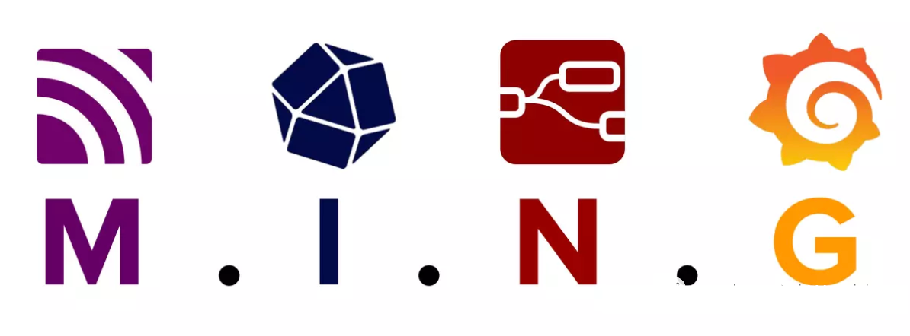

The vision of evolving from Purdue Preference Model to 3-layer model/no-layer model is an old story often shared by almost every industrial digitalization vendor. The following diagram is frequently used to demonstrate the transformation:

There is always a dream, where any hierarchical system, device, or person in an enterprise can communicate with a single source of truth, achieving unparalleled data fluidity and interoperability.

<!--truncate-->

However, with the current business software tools like REST spaghetti, OPC chaos, ETL garbage trucks, and SQL weaving machines, achieving a single source of truth is not feasible.

Around 2015, a North American IIoT enthusiast named Walker Raynolds began using message brokers as the core of a 3-layer architecture, spreading his practice within the community. This simple method was proved surprisingly efficient, quickly gained popularity and was adopted by some cutting-edge companies.

## What is UNS

In practice, the core of UNS (Unified Namespace) is an MQTT broker. Simply put, a UNS allows data sources and consumers to subscribe bidirectionally to a centralized MQTT broker.

## How to Make a UNS

### Define Data Modeling Framework and MQTT Topics

When it comes to defining the format of MQTT topics, currently, ISA95 Part 2 and SparkPlugB are popular schemas. The former is used for enterprise-level data integration, while the latter is for device-level data integration. Methodology and research are crucial in this process.

### Data Processing/Contextualization

Imagine a scenario like this, we connect a thermocouple through a gateway box, which sends a payload defined by the gateway box containing an int value **00355**.

It represents the thermocouple temperature 35.5°C. At this point, we need a software to convert the value to 35.5, reformat the JSON payload, and then publish it to the MQTT broker.

This is often the job for IIoT platforms like supOS, or NodeRED.

### Establish Publish/Subscribe Connections

After converting the temperature value, we define a topic **Site1/Unit1/ThermoCouple1** in the MQTT broker and publish the data to this topic via NodeRED. Any system that wants to obtain the real-time value of the thermocouple only needs to subscribe to this topic.

After completing these 3 steps, the simplest UNS has been established, which achieved real-time data communication across software layers.

## UNS Features

### Simple and Lightweight
This is the most important feature of UNS.

UNS is so simple that a thousand-word article can give you a clear impression. If it were OPC UA, even 10,000 words might not be able to explain one companion spec, and if it were an IIoT platform, you probably are still working on the policies.

Deploying an MQTT broker and connecting to it is much simpler than using Kepware, which is why **Mosquito** is widely used for home automation.

### Event-driven and Edge-driven
A UNS based on an MQTT broker is a typical event-driven architecture. The idea of triggering something when an event happens allows us to define and develop industrial applications, simply and clearly.

MQTT payloads accept all comers; publishers can customize and modify their messages and logic at any time. This gives control and data processing power to the devices and nodes accessing the UNS. Combined with edge-level data tools like NodeRED, enterprises can scale the UNS without sacrificing security, performance, or fault tolerance.

### Report by Exception
Most data in control and software systems remain unchanged for long periods. Using traditional methods to obtain data periodically can be a waste of bandwidth. In large enterprises, this waste can make it theoretically impossible to establish a single source of truth. 

UNS, based on the **Publish on Change** mechanism, makes our lives much easier.

### Highly Scalable
Commercial brokers like **EMQX** and **HiveMQ** have refined their products to a cloud-native level. When we connect to an MQTT address, a high-availability cluster is behind it, aligning with the trend of layered high availability and scalability.

### Real-time Snapshots
The UNS mentioned above includes only real-time data. Industrial data integration also needs to include OLTP and OLAP for historical data. In the next blog, I will introduce how open-source time-series databases and NodeRED solve this problem disruptively, and the **MING Stack** proposed by Balena.

## Conclusion

Today, large institutions and vendors like Gartner, SAP, ARC, and Wipro are discussing UNS, but it is the startups that are truly practicing or productizing this approach.

I believe UNS will eventually outpace the bloated and aging OPC with its agility and simplicity. Small teams can surpass large companies entangled in conceptual weaving through passion and dedication, marking a new trend in the digital age.