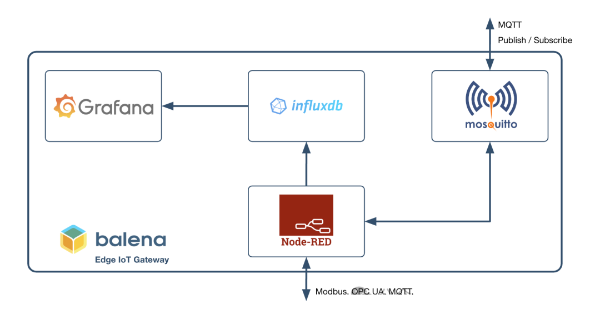
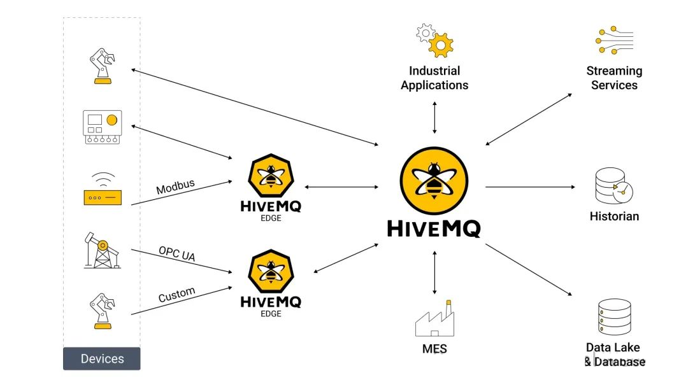
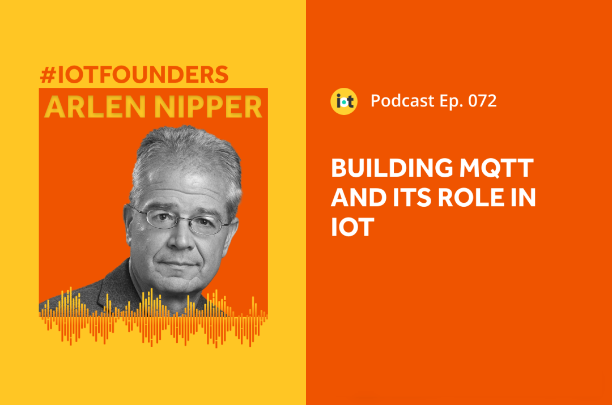
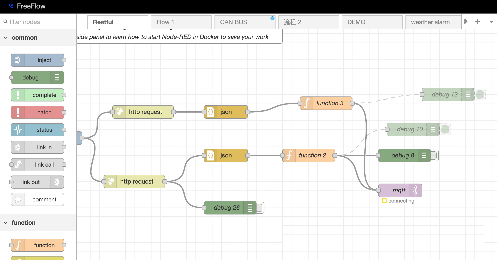
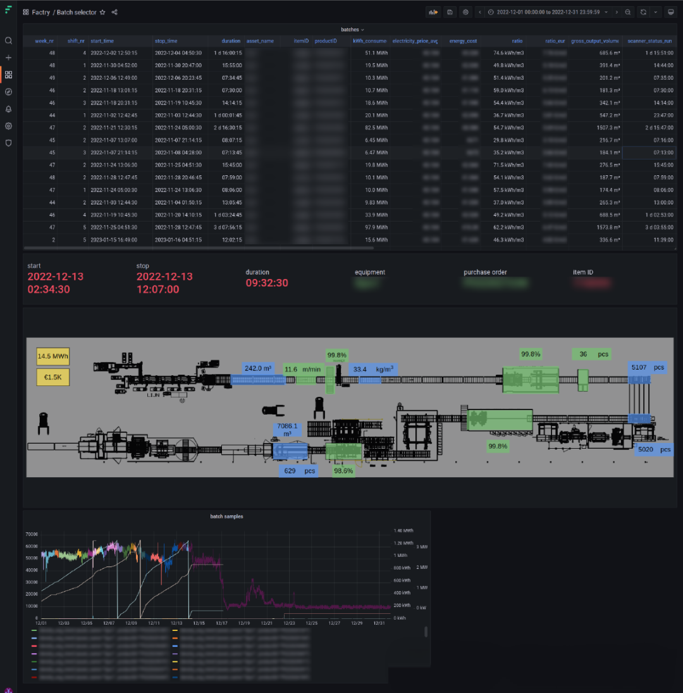

MING reprsents the combination of 4 open source software including Mosquitto, InfluxDB, NodeRED and Grafana. MING is a groundbreaking industrial data integration and visualization toolchain.

<!--truncate-->

As shown in the diagram above,
- NodeRED parses protocols to retrieve data, feeds it to Mosquitto for application layer consumption.
- The data is stored in InfluxDB for trend analysis.
- Grafana provides the human-machine interface for direct data display.
This is a classic use case of MING in IIoT.

MING's components were invented at different times for different purposes and began to be combined in industrial and IoT communities around 2017. While not as universally recognized as the iPhone at recent times, MING has, ever since its inception, miraculously transformed the industrial IoT software.

## Mosquitto

Mosquitto is the most popular MQTT Broker. Today, EMQX and HiveMQ dominate the industrial sector, with Hive making deeper inroads by supporting numerous industrial protocols and software interfaces (drivers). The Broker in MING serves as the protocol hub, forming the data foundation for IIoT use cases.

MQTT, a well-known protocol, is often met with skepticism when applied in industrial settings—concerns about security, real-time capabilities, and completeness abound.
However, critics often overlook how fragmented industrial software, especially IIoT software, is, engineering-wise. 
- We're still developing in C# for Windows GUIs, even dubbing it **HMI Development**.
- Our real-time communication relies on miles of cables and Ethernet switches.
- In 2024, we are still isolating risks through **firewalls**.

MQTT's inception decades ago aimed at integrating telemetry data in oil and gas. Its creator remains active in IIoT, using the new method **Ignition + MQTT** to empower SCADA.

MQTT directly led to the birth and popularity of the **Unified Namespace**, integrating publish/subscribe, edge-driven, high fault tolerance, and redundancy into a minimalist standard. This handed the implementation of Brokers to communities and commercial companies, humbling OPC.

:::info
See <a href="../2024-07-18-UNS/index">UNS</a> for details about the unified namespace.
:::

## InfluxDB

InfluxDB and its components in MING are tools for data storage and analysis, similar in use cases to Historian + TSDB: Massive real-time data writes with timestamps, aggregate queries, and statistics.

Time-series databases emerged around 2015, meeting the surging logistics and IoT demands back then. People sought databases adept at handling high-speed real-time writes, ultimately shifting away from traditional tech like PI or KDB, to invent real-time/historical databases—Influx leading the charge. 

Developing software in the 2010s naturally leaned towards open sourcing; Influx inadvertently disrupted the industry. 

Today, more TSDBs, like TDengine, emerging in a cluster and open source posture, challenging Influx's reign. Competition intensifies, as TSDBs vie in cloud-native, data analytics, and data warehouses arenas, with classics like PI, PHD, distancing from tech frontiers.

## NodeRED

NodeRED, IBM's 2018 open-source, low-code, flow-based programming software, akin to iPhone's multitouch, endowed MING with low-threshold magic, turning OT engineers—even laymen—into **Citizen Developers**. 

NodeRED, built on NodeJS, simplifies deployment, use, and development. In IIoT, it excels in resolving the **last-mile issues**. Like the common UNS implementation challenge: 

> My software lacks MQTT, and can only work with webhook and REST. How do I communicate with MQTT Broker?

In NodeRED, engineers with no network programming basics can achieve **MQTT to Anything** setups in 5 minutes with drag-and-drop configurations.

However, NodeRED is not a panacea. Its efficiency dips with complex logic and data processing, and issues from NodeJS runtime begin surfacing as well. 

Yet, None of these stands in the way of NodeRED being catapulted across Japan, Southeast Asia, and the Americas. Because of its ease of use, it has become the de facto standard for boutique integrators and IIoT teams.

## Grafana

Grafana, also a famous open-source software, is ubiquitous in monitoring dashboards for almost all internet companies.

OT professionals raised eyebrows at Grafana in SCADA usage, but couldn't pinpoint its inappropriateness. Community members daringly tried Grafana for production, with UMH's project as a prime example.

It's not hard to perceive from their dashboards that the imagined thresholds like feedback, real-time, and graphic elements are no where to find. Web, the freshest UI platform, makes the web-native Grafana, easily distributable across hardware, and highly flexible.

## Features

MING's competitive edge stems from its multifaceted strengths, with three points illuminating IIoT's trajectory:

### Open Source
- Zero cost lowers barriers; commercial equivalents can't compete.
- User base and community culture often amplify open-source software's efficacy beyond commercial rivals.
- Upon market and tech standard dominance, open-source software monetizes via freemium and premium models. Kong, Redis are successful cases.

In the highly fragmented, low-barrier, consensus-driven world of IIoT, the competitive edge of open source is amplified.

### Ease of Use
Tags, configurations, objects, registers—terms and operations OT/IT engineers must endure. With inscrutable names and mechanical routines, they seem more difficult to handle than they really are. 

Just like the classic phones' sliders, various SIM sizes, they equal to nothing but mind burden brought by technical bottlenecks and behindhand HMI design.

NodeRED balances efficiency and simplicity in OT data integration, while drag-and-drop fails in the competitive IT world.

### Modernization
Ingenious products fail to transcend time; decades later, they will be hailed as classics but sidelined in mainstream engineering.

In 2024, Web, containers, and cloud technologies signal modernity, and old Windows XP software shouldn't be considered as a rival. 

The future will not arrive in a blink of an eye, even with specific technologys direction. Don't expect a miraculous IT silver bullet to breach traditional industrial software's moat. 

Windows workstations in assembly lines and control rooms will persist; operators, engineers prefer SCADA tech, comparing to Web, and decision makers will not experiment on production.

Iterating traditional software and chasing integrative innovations like MING are equally vital, harboring systemic business opportunities. But in software, the future builds not from the past. OT software should envision a **Linux Rust**, reimagine industry with modern tech, shed burdens, maximize engineer creativity, and rebuild the future.

## Conclusion
Over nearly a decade, IIoT toolchains evolved MING into platform engineering + applications. Next article, I'll delve into today's best tech combos and practices in IIoT.